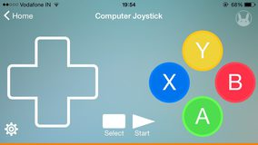

### Tah Play
Tah Play app let you play games on your computer or play station using your smartphone. Just upload Play arduino code on Tah and plug it into computer or play station and you are ready to go. It's computer joystick comes with programmable keys which can be changed from game to game.
This app requires a Tah connected to your computer.   
This repository consists of the iOS and Android(coming soon) source code along with the corresponding Arduino sketch for the Tah Play app.  

    
<a href="https://itunes.apple.com/us/app/tah-play/id945578953?mt=8"></img></a>
---

## Usage

#### Arduino
* Install the [Tah Arduino Library](https://github.com/tah-io/Tah_Arduino_Library#installing)
* Download the [Play sketch](https://raw.githubusercontent.com/tah-io/Tah-Play/master/Play/Play.ino)
and open it in the Arduino IDE
* Upload it on your Tah board

#### iOS
* Clone the repo

		git clone https://github.com/tah-io/Tah-Play.git

* Change directory to the appropriate submodule (iOS or Android)

		cd Tah-Play-iOS

* Initialize and update the submodule

		git submodule init
		git submodule update
* Open the Xcode project file TAH Play.xcodeproj 
